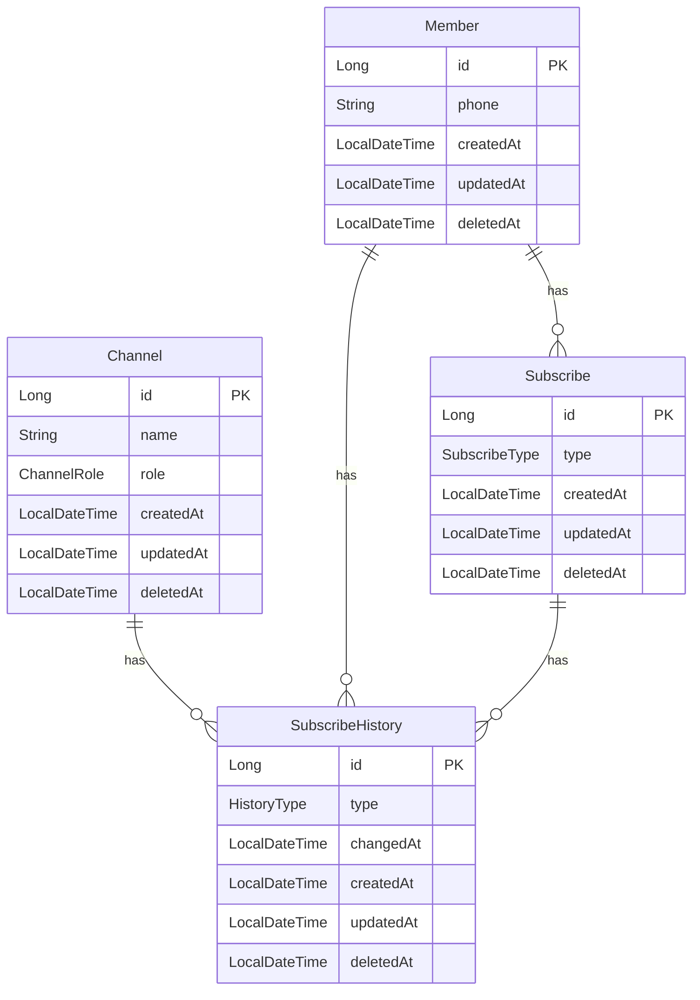

# 구독 서비스 관리 시스템
구독 서비스 관리 기능을 구현한 백엔드 시스템입니다.

1. ERD(Entity Relationship Diagram) - mermaid 형식으로 작성하여 시각적으로 표현
2. 주요 엔티티에 대한 설명
3. API 명세서 (구독하기, 구독 해지, 구독 이력 조회)
   - URL, 메소드, 요청/응답 형식
   - 성공 및 실패 시나리오별 응답
4. 비즈니스 규칙
   - 구독 상태 변경 규칙
   - 채널 권한에 따른 제약
   - 외부 API 응답에 따른 처리 로직

GitHub에서는 mermaid 다이어그램이 자동으로 렌더링되어 ERD를 시각적으로 확인할 수 있습니다.

## ERD (Entity Relationship Diagram)


## API 명세서

### 구독하기 API
- **URL**: `/api/v1/subscribe`
- **Method**: `POST`
- **Description**: 구독하기 API
- **Request Body**:
```json
{
  "phone": "1012345678",
  "channelId": 1,
  "type": "BASIC"
}
```
`type`은 구독 상태를 나타내며, `NONE` 또는 `BASIC` 또는 `PREMIUM` 중 하나로 설정할 수 있습니다.

- **200 Success Response**:
```json
{
  "phone": "1012345678",
  "channelId": 1,
  "subscribeType": "BASIC"
}
```

- **400 Error Response**:
```json
{
  "httpMethod": "POST",
  "path": "/v1/subscribes",
  "message": "잘못된 채널 입력값 입니다.",
  "timestamp": "2025-03-14T22:44:35.321782",
  "error": null
}
```
```json
{
  "httpMethod": "POST",
  "path": "/v1/subscribes",
  "message": "잘못된 구독 변경입니다.",
  "timestamp": "2025-03-14T22:44:35.321782",
  "error": null
}
```

- **403 Error Response**:
```json
{
  "httpMethod": "POST",
  "path": "/v1/subscribes",
  "message": "구독할 수 없는 채널입니다.",
  "timestamp": "2025-03-14T22:45:10.770594",
  "error": null
}
```

- **404 Error Response**:
```json
{
  "httpMethod": "POST",
  "path": "/v1/subscribes",
  "message": "존재하지 않는 회원입니다.",
  "timestamp": "2025-03-14T22:46:10.770594",
  "error": null
}
```

- **500 Error Response**:
```json
{
  "httpMethod": "POST",
  "path": "/v1/subscribes",
  "message": "서버 에러 입니다.",
  "timestamp": "2025-03-14T22:38:55.086638",
  "error": null
}
```
  
### 구독 해지 API
- **URL**: `/api/v1/subscribe/cancel`
- **Method**: `POST`
- **Description**: 구독 해지 API

- **Request Body**:
```json
{
  "phone": "1012345678",
  "channelId": 1,
  "type": "BASIC"
}
```
`type`은 구독 상태를 나타내며, `NONE` 또는 `BASIC` 또는 `PREMIUM` 중 하나로 설정할 수 있습니다.

- **Request Body**:
```json
{
  "phone": "1012345678",
  "channelId": 1,
  "type": "BASIC"
}
```

- **200 Success Response**:
```json
{
  "phone": "1012345678",
  "channelId": 1,
  "subscribeType": "BASIC"
}
```

- **400 Error Response**:
```json
{
  "httpMethod": "POST",
  "path": "/v1/subscribes/cancel",
  "message": "잘못된 채널 입력값 입니다.",
  "timestamp": "2025-03-14T22:44:35.321782",
  "error": null
}
```
```json
{
  "httpMethod": "POST",
  "path": "/v1/subscribes",
  "message": "잘못된 구독 변경입니다.",
  "timestamp": "2025-03-14T22:44:35.321782",
  "error": null
}
```

- **403 Error Response**:
```json
{
  "httpMethod": "POST",
  "path": "/v1/subscribes/cancel",
  "message": "구독할 수 없는 채널입니다.",
  "timestamp": "2025-03-14T22:45:10.770594",
  "error": null
}
```

- **404 Error Response**:
```json
{
  "httpMethod": "POST",
  "path": "/v1/subscribes/cancel",
  "message": "존재하지 않는 회원입니다.",
  "timestamp": "2025-03-14T22:46:10.770594",
  "error": null
}
```
```json
{
  "httpMethod": "POST",
  "path": "/v1/subscribes/cancel",
  "message": "존재하지 않는 구독 정보입니다.",
  "timestamp": "2025-03-14T22:46:10.770594",
  "error": null
}
```

- **500 Error Response**:
```json
{
  "httpMethod": "POST",
  "path": "/v1/subscribes/cancel",
  "message": "서버 에러 입니다.",
  "timestamp": "2025-03-14T22:38:55.086638",
  "error": null
}
```

### 구독 이력 조회 API
- **URL**: `/api/v1/subscribe-history`
- **Method**: `GET`
- **Description**: 구독 이력 조회 API

- **Request Parameters**:
```http request
GET /api/v1/subscribe-history?phone=1012345678
```
`phone`은 구독 이력을 조회할 회원의 휴대폰 번호입니다.

- **200 Success Response**:
```json
{
  "content": [],
  "page": {
    "size": 20,
    "number": 0,
    "totalElements": 0,
    "totalPages": 0
  }
}
```

- **404 Error Response**:
```json
{
  "httpMethod": "POST",
  "path": "/v1/subscribes/cancel",
  "message": "존재하지 않는 회원입니다.",
  "timestamp": "2025-03-14T22:46:10.770594",
  "error": null
}
```

## 비즈니스 규칙

### 구독 상태 변경 규칙
- 구독 안함 → 일반 구독
- 구독 안함 → 프리미엄 구독
- 일반 구독 → 프리미엄 구독

### 구독 해지 상태 변경 규칙
- 프리미엄 구독 → 일반 구독
- 프리미엄 구독 → 구독 안함
- 일반 구독 → 구독 안함

### 채널 권한에 따른 제약
- 구독 가능 채널
  - 홈페이지, 모바일앱, 네이버, SKT, KT, LGU+
- 구독 해지 가능 채널
  - 홈페이지, 모바일앱, 콜센터, 채팅상담, 이메일 

### 외부 API 응답에 따른 처리 로직
- 외부 API 호출 및 응답에 따른 트랜잭션 처리
- 외부 API 호출 예시
```shell
curl -X GET https://csrng.net/csrng/csrng.php?min=0&max=1
```
- 외부 API 응답 예시
```json
[ { "status": "success", "min": 0, "max": 1, "random": 1 } ]
```
- 외부 API 응답에 따른 처리
  - `random = 1` → 정상적으로 트랜잭션을 커밋
  - `random = 0` → 예외 발생 및 트랜잭션 롤백
  - 구독하기 API와 구독 해지 API에 외부 API 호출 및 응답에 따른 트랜잭션 처리 포함
